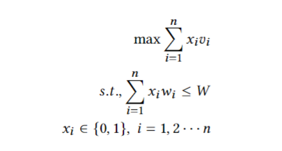
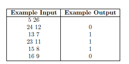

## Introduction
This repo holds four algorithm to solve knapsack problem. \
A typical knapsack problem is to solve the following constrained integer programming problem: \


The DATASET includes 10 small scale instances and 21 large scale instances provided by Professor.\
You can use your own dataset and save it with the following format where the first row is the number of items and the maximum capacity of the knapsack.
The output 0/1 represents whether one item is chosen.\


We saved the output with two files: one is the trace file which includes the time and the quality of the result when the 
performance improved; the solution file which includes two lines (the optimal quality, the index of the chosen items).


## Algorithms
BnB.py: the branch and bound algorithm \
HC.py: the hill climbing algorithm \
SA.py: the simulated annealing algorithm \
FPTAS.py: approximate algorithm based on dynamic programming \
main_KSP.py: the main function

## Package required
* python 3
* numpy
* pathlib
* matplotlib
* os
* argparse


## To run the code:
Input
```angular2html
python main_KSP.py -inst filename -alg "[BnB|FPTAS|HC|SA]" -time "cutoff time" -seed 1
```
For example, you can run the small-1 instance by the following command in windows:
```angular2html
Python main_KSP.py -inst .\\DATA\\DATASET\\small_scale\\small_1 -alg HC -time 5 -seed 1
```
The results (solution files and trace files) are saved in the folder "output" named by the name of the instances.

## Plot
To plot the boxplot, QRTD plot and SQD plot for the large-scale 1 and large-scale 3 instances with 
results of using the Simulated annealing and Hill climbing algorithm,
change the flag ```LS_plot``` in the ```main_KSP.py```to be true.
Make sure the trace files for 20 or more runs are stored in a folder.

## Report
A detailed report can be folder in the same folder, named as ```report.pdf```.
